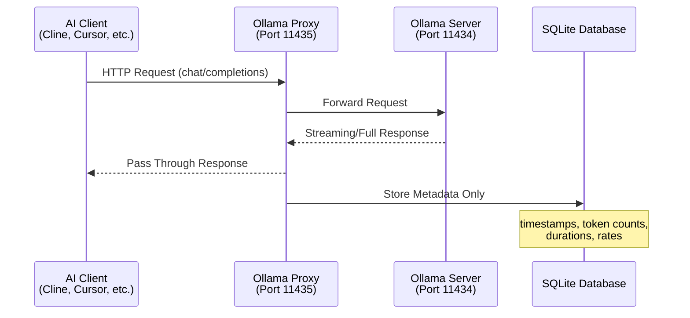

# 📊 Ollama Usage Proxy


> A lightweight, transparent local HTTP proxy to monitor, log, and analyze your local LLM usage against paid API rates in real-time.

---

## Architecture



Your AI client connects to the proxy on **port 11435** instead of Ollama directly on **port 11434**. The proxy forwards every request unchanged, streams responses back with zero buffering, and records only metadata to a local SQLite database.

---

## Key Features

| Feature | Description |
|---|---|
| **Real-Time Dashboard** | Built-in web dashboard with live GPU telemetry (temperature, power, utilization) and token throughput charts over WebSocket. |
| **In-Flight Status Tracking** | Live status badge shows whether the proxy is idle, thinking (model load/prompt eval), or generating (streaming tokens). |
| **Session Token KPIs** | Dedicated counter cards display cumulative input/output tokens for the current session. |
| **Zero-Latency Stream Passthrough** | Responses stream in real-time with no buffering. The proxy adds negligible overhead by processing metrics from the final response chunk. |
| **Cost Comparison Analytics** | Estimate what your local token usage would cost if routed through paid providers like Claude, GPT-4, or Gemini—using fully configurable pricing. |
| **Token Processing Speed Graphs** | Visualize input/output token rates over time with weighted-average calculations that reflect true processing performance. |
| **Privacy-First Architecture** | Only metadata is stored. Prompts, responses, file content, and system instructions are never captured or logged. |

---

## Real-Time Dashboard

Starting in **v0.4.0**, the proxy includes a built-in single-page dashboard accessible at `http://localhost:11435/dashboard` (or the root URL). No extra installation is required.

### What You'll See

| Panel | Metrics |
|---|---|
| **Status Badge** | Real-time proxy state: idle (gray), thinking (pulsing yellow), generating (pulsing green) |
| **GPU KPI Cards** | Live temperature (°C), power draw (W), and core utilization (%) |
| **In-Flight KPI** | Number of active requests currently being proxied |
| **Total Tokens KPI** | Cumulative session input/output token counts |
| **GPU Temperature Chart** | Live smooth line chart with gradient fill (soft rose) |
| **GPU Power Chart** | Live smooth line chart with gradient fill (soft amber) |
| **GPU Utilization Chart** | Live smooth line chart with gradient fill (soft purple) |
| **Token Output Rate** | Tokens/second as a smooth line chart (soft emerald) |
| **Input Token Activity** | Discrete per-second input token counts (soft cyan bar chart) |
| **Output Token Activity** | Discrete per-second output token counts (soft blue bar chart) |
| **Request Log** | Scrollable table of recent proxy requests with model, tokens, and rates |

### Screenshots

#### Idle — No Active Requests

The dashboard displays an **idle** status when no LLM requests are being proxied. GPU metrics reflect baseline hardware state (fan idle, low power draw). Token charts remain flat until a request arrives.


#### Thinking — Model Load & Prompt Evaluation

The **thinking** status appears when the proxy is forwarding a request but the model is still loading into memory or evaluating the prompt (before token generation begins). GPU utilization and power typically spike during this phase as the model processes the full context window. This state is common with large models that aren't already cached in VRAM.


#### Generating — Streaming Output Tokens

The **generating** status indicates the model is actively producing and streaming output tokens back to the client. This is where token output rate charts come alive, showing real-time throughput. GPU power and utilization remain elevated while tokens are being generated.


### GPU Telemetry Requirements

Live GPU metrics require:

* **Linux** host (detected at runtime)
* **NVIDIA** GPU with NVML drivers installed
* **nvidia-ml-py** Python package (official NVIDIA bindings, included as a dependency)

On non-Linux hosts or when no NVIDIA device is detected, the dashboard displays a **"System Stats Offline"** banner and gracefully omits the GPU charts. Token charts and request logs continue to work normally.

### How It Works

1. A background task polls GPU hardware every second via `nvidia-ml-py`
2. Readings are persisted to SQLite (`system_metrics` table)
3. A WebSocket feed at `/api/ws` pushes JSON frames to all connected browser tabs
4. The dashboard uses **Alpine.js** + **Chart.js** (loaded from CDN) for reactive UI and performant live-scrolling charts
5. On page load, `/api/history` seeds the charts with stored data so you never see blank graphs

> **No Node.js or build step required.** The dashboard is a self-contained HTML file served directly by the proxy, making it compatible with PyInstaller single-binary distributions.

---

## Installation

Choose the method that best fits your workflow.

### Method A: Single-Command Launch (Recommended)

Run the proxy instantly with [`uv`](https://github.com/astral-sh/uv)—no package installation or virtual environment required:

```bash
uv run --from ollama-usage-proxy ollama-proxy
```

Or execute directly from the repository source:

```bash
uv run https://raw.githubusercontent.com/xtremecool/ollama-metrics-proxy/main/src/ollama_usage_proxy/app.py
```

This boots the proxy on `http://127.0.0.1:11435` in seconds. Add `--help` for CLI options.

### Method B: Pre-Compiled Binary (No Python Required)

Download a ready-to-run executable from the [Releases](https://github.com/xtremecool/ollama-metrics-proxy/releases) tab:

```bash
# Download the latest release, make executable, and run
chmod +x ollama-proxy
./ollama-proxy
```

Single-file binaries are built with PyInstaller and include all dependencies. No Python interpreter or `pip` needed.

### Method C: Traditional Developer Install

For contributing or local development:

```bash
git clone git@github.com:xtremecool/ollama-metrics-proxy.git
cd ollama-metrics-proxy

python3 -m venv .venv
source .venv/bin/activate

pip install -e ".[dev]"
```

Once installed, both commands are available globally within the virtual environment:

```bash
ollama-proxy    # starts the proxy server
ollama-report   # generates usage reports and graphs
```

---

## Client Configuration

Point your AI coding assistant or editor plugin at `http://localhost:11435` instead of the default Ollama port.

### Cline (VS Code)

| Setting | Value |
|---|---|
| Provider | `Ollama` |
| Base URL | `http://localhost:11435` |
| Model | *(your preferred model, e.g., `qwen3-30b`)* |

### Cursor IDE

1. Open **Settings** → **Connections** (or **Features** depending on version)
2. Toggle **Ollama** to **ON**
3. Set endpoint address to `http://localhost:11435`
4. Select your model from the dropdown

### Continue.dev

Add or update the Ollama provider block in your `.continue/config.json`:

```json
{
  "providers": [
    {
      "title": "Ollama",
      "apiName": "ollama",
      "apiBase": "http://localhost:11435",
      "models": [
        {
          "title": "qwen3-30b",
          "name": "qwen3-30b"
        }
      ]
    }
  ]
}
```

---

## Generating Reports

Produce trend graphs and summary documents from your collected usage data:

```bash
ollama-report
```

Or invoke directly through Python:

```bash
python -m ollama_usage_proxy.report_main
```

**Optional filters:**

```bash
ollama-report \
    --from 2025-01-01 \
    --to 2025-01-31 \
    --group-by day
```

| Option | Default | Description |
|---|---|---|
| `--from` | Auto-based on bucket | Start date (YYYY-MM-DD) |
| `--to` | Present | End date (YYYY-MM-DD) |
| `--group-by` | `day` | Aggregation: `hour`, `today`, `day`, `week`, `month` |
| `--prices` | Bundled default | Path to custom pricing TOML |

### Generated Artifacts

Reports are written to `~/.local/share/ollama-usage-proxy/reports/`:

| File | Description |
|---|---|
| `token_usage_daily.png` | Line chart of input/output/total tokens over time |
| `token_rates_daily.png` | Weighted token processing rates |
| `paid_model_cost_daily.png` | Daily equivalent cost by paid model |
| `paid_model_cost_cumulative.png` | Cumulative cost comparison |
| `summary.csv` | Aggregated metrics in CSV format |
| `summary.md` | Human-readable Markdown summary |

---

## Configuration (Optional)

Copy the example files and adjust to your environment:

```bash
cp examples/config.example.toml config.toml
cp examples/prices.example.toml prices.toml
```

**`config.toml`:**

```toml
[proxy]
listen_host = "127.0.0.1"
listen_port = 11435
ollama_base_url = "http://127.0.0.1:11434"

[database]
path = "~/.local/share/ollama-usage-proxy/usage.db"

[reporting]
output_dir = "~/.local/share/ollama-usage-proxy/reports"
```

**`prices.toml`:**

```toml
[[paid_models]]
name = "claude-sonnet-4-20250514"
currency = "USD"
input_per_million = 3.00
output_per_million = 15.00

[[paid_models]]
name = "gpt-4.1-mini"
currency = "USD"
input_per_million = 0.40
output_per_million = 1.60
```

Bundled defaults are used automatically when custom config files are absent.

---

## Privacy Commitment

Your prompts and responses never leave your machine. The proxy stores **only** the following metadata:

### Collected

- Request timestamps (UTC)
- HTTP method and request path
- Model name
- Status codes
- Token counts (input, output, total)
- Processing durations (load, prompt evaluation, generation)
- Derived token-rate metrics
- Error messages (if any)

### Never Collected

- Prompt text or user input content
- Generated responses or code output
- File contents or repository data
- System instructions or task definitions
- API keys, secrets, or credentials

The SQLite database resides entirely on your local filesystem at `~/.local/share/ollama-usage-proxy/usage.db`.

---

## Troubleshooting

### Proxy starts but the client cannot connect

```bash
# Verify proxy health endpoint
curl http://localhost:11435/health
# Expected: {"status": "ok", "proxy": true, "gpu_online": true}
```

The `gpu_online` field indicates whether the NVIDIA telemetry module initialised successfully. A value of `false` is normal on non-Linux hosts or when no NVIDIA GPU is present—the dashboard will still work but GPU charts will show an offline placeholder.

Ensure Ollama is running on port 11434 and the proxy is listening on 11435. Check proxy logs for connection errors.

### No data appears in reports

1. Confirm your client points to the proxy (`:11435`), not Ollama directly (`:11434`)
2. Verify the database path matches the proxy configuration (default: `~/.local/share/ollama-usage-proxy/usage.db`)
3. Check the proxy log output for evidence of processed requests

### Dashboard shows "System Stats Offline"

This is expected when:
* Running on macOS or Windows (GPU telemetry is Linux-only)
* No NVIDIA GPU is detected
* `nvidia-ml-py` cannot initialise (missing NVML drivers)

Token charts and the request log still work in this mode. To enable GPU metrics, run on a Linux host with an NVIDIA GPU and ensure the `nvidia-ml-dev` (or equivalent) packages are installed.

### Streaming feels slow

The proxy adds negligible latency by design. If delays are noticeable, check SQLite disk I/O performance and database file permissions.

---

## License

This project is licensed under the **MIT License**. See [LICENSE](LICENSE) for full terms.
Attribution to the original author must be provided in derivative works.